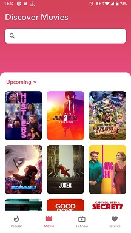

# Proyek Akhir: Aplikasi Movie Catalogue

##### Home

#####Widget

#####Notification

##### Movie Fragment

##### Favorite Fragment

##### Search Movie

### Kriteria
- Pengguna dapat melakukan pencarian Movies.
- Pengguna dapat melakukan pencarian Tv Show.
- Pengguna dapat menampilkan widget dari film favorite ke halaman utama smartphone.
- Tipe widget yang diterapkan adalah Stack Widget.
- Daily Reminder, mengirimkan notifikasi ke pengguna untuk kembali ke Aplikasi Movie Catalogue. Daily reminder harus selalu berjalan tiap jam 7 pagi.
- Release Today Reminder, mengirimkan notifikasi ke pengguna berupa informasi film yang rilis hari ini (wajib menggunakan endpoint seperti yang telah disediakan pada bagian Resources di bawah). Release reminder harus selalu berjalan tiap jam 8 pagi.
- Terdapat halaman pengaturan untuk mengaktifkan dan menonaktifkan reminder.
- Membuat aplikasi atau modul baru yang menampilkan daftar film favorite.
- Menggunakan Content Provider sebagai mekanisme untuk mengakses data dari satu aplikasi ke aplikasi lain.
